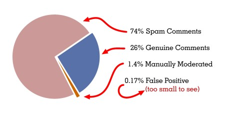
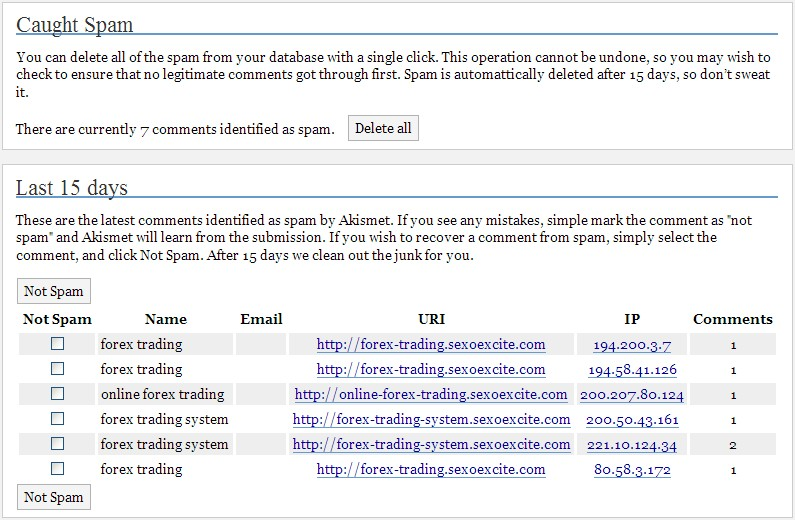

# Akismet - Comment Spam Killer

This website - like any website that allows readers to submit comments - receives comment-spam, usually advertising medicines, gambling, or other vices. I've been trialling a new [anti-comment-spam plugin](http://photomatt.net/2005/09/19/stop-spam-better/) since mid September. It's called Kismet, it's from [Automattic](http://automattic.com/), (hence <a href="http://akismet.com/">Akismet</a> for short) and it's working <em>very</em> well. Comment spam is more costly than email spam because it either wastes the time of the website owner, who has to remove it, or it wastes the time of every reader of the website who has to separate the wheat from the chaff. It's going to be launched tonight (i.e. Tuesday Afernoon, in Texas).

## Effective Comment-Spam Relief
According to [Matt Mullenweg](http://photomatt.net), the curator of Automattic, there were "only a dozen or so" active users during the trial that I was involved in, and the system should "become more effective as more people use it". The basic stats from my trial experience were as follows:

| Message Count | Percentage of Total | Explanation |
|---|---|---|
| 574 | 100% | The total number of comments this site received since the trial began. |
| 425 | 74% | The number of those comments that were spam. |
| 6 | 1.4% | The number of comments that had to be manually marked as spam. |
| 1 | 0.17% | The number of comments incorrectly identified as spam by Akismet (a.k.a. false positives). |

For people whose blog content is predominantly idle chatter, this plugin will remove the need for user moderation, allowing a far more interactive blogging experience between blogger and readers.

### How it Works

It's based on the principle that once a comment spam message is identified by one recipient, and corroborated by others, all similar messages can be marked as spam, reducing the spammer's potential audience from thousands of people, to the few that report the message when it first arrives. It works, approximately like this... When a comment is received by a website, it is checked against a worldwide database to see if it matches any messages that are known to be from spammers, this might be based on:

1.  the IP addresses that the message originated from,
2.  the web addresses being promoted,
3.  a string in the content that can be matched by a regular expression,
4.  or any other number of potential techniques that have not (yet) been disclosed. Messages that are considered to be spam are automatically separated, and the moderator then has 15 days to check through them (in case there are any false positives) before they are removed forever. Spam comments are never visible on the site and the spam checking interface is very simple to use.

### Threats to it's Effectiveness

I've been thinking such a service should exist for a long time, so I'm keeping my fingers crossed that it stays effective. There are, however, several obstacles that may have to be overcome if it is to be a success.

#### Spam-Run Duration

Services such as this will change the delivery pattern of comment spam. This will happen because the time window in which spam comments can get through will be drastically reduced to the very short period of time between start of the spam-run and the point when the spam has been identified and corroborated. In the short time before the spam is reported, messages can get through, so it is likely that spam-runs will become short, high volume bursts. In lieu of this it may eventually be necessary to check each received message more than once, so that spam messages which are not immediately spotted when they are received can still be automatically discarded.

#### DDoS Target

The central server(s) may become a prime target for DDoS attacks if/when spammers realise that their spamming is no longer effective. The purpose of a DDoS attack would be to disable the automatic checking of comments, perhaps breaking the system and thereby letting their comments through. It is likely that spammers would have to coordinate such an attack to coincide with a spam run, rather than relying on luck. The good news is that this would elevate the spammer from _nuisance_ to _criminal_, so there are some very heavy legal books that can be thrown at anyone silly enough to try it.

#### Privacy

Some people may be concerned about the fact that every message they receive is sent to a third party for analysis. When one considers that these are supposed to be public comments on a public website, the privacy concern fades a little, but some people do still write private information in comments because the web is used by people, and people make mistakes, so it's a concern that can't be completely ignored. One possible solution to both the Privacy and DDoS issues might be to provide replicated access to the Spam Database (probably on a registration only basis) so that there are multiple sites that could provide the service. Privacy concerns could be offset by enabling the website owner to select which service provider is used, or to provide their own service. Another possible solution to some privacy concerns would be the ability to mark some posts for manual checking only, thus ensuring message privacy.

#### Comment Censorship

What the service does, effectively, is silence individuals who are misusing the Web, however, there is potential for this capability to be misused, because it becomes feasible to mount a censorship attack on an individual or company - i.e. If you have the programming skill, it's not too difficult to create a dummy message, mark it as spam and submit it to the service. If the spam-identification mechanisms are too sensitive or simplistic, then it may be possible to censor someone who hasn't actually sent any spam.

## Download & Installation

If you're familiar with installing WordPress plugins, it's all a simple process. You can [get the Akismet plugin](http://dev.wp-plugins.org/file/akismet/trunk/akismet.php) already, it's available from the open source software repository that manages all WordPress plugins. You can also get it from the [Akismet download page](http://akismet.com/download/). Installation is simple, just add the php file to your wp-content directory and enable it. Enabling the plugin gets you 80% there, but you're not done yet. In order to protect itself against spammers who, [Akismet](http://akismet.com/) uses an API key. You must obtain a key before the plugin will begin to work. The mechanism by which you can get your keys is what [Automattic](http://automattic.com) will launch later today.

## Automattic for The People

As websites and personal publishing have flourished, comment spam propagated by a selfish few has become a significant problem for the masses. [Akismet](http://akismet.com/) redresses the balance, at least for [WordPress](http://wordpress.org/) users. By automatically curtailing spam publication, [Akismet](http://akismet.com/) takes the wheels off the comment-spam gravy train. Hereafter, spammers will have to look for non-WordPress powered blogs to hawk their wares.
