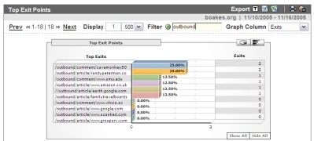

# Google Analytics Plugin for Wordpress

This is the first beta release of a WordPress plugin that can add Google Analytics to your website without you needing to code one single set of angle-brackets.  I have it running on this site and it seems to be working just fine so far.

## Installation instructions

To use it:

1.  If you have a previous version of the plugin, delete it.
2.  ~~Download this file~~ `This code is now obsolete!`
3.  Rename the file `googleanalytics.php` and copy it to your `/wp-content/plugins` directory.
4.  Enable it on the plugins page.
5.  Enter your Google Analytics User Account string (it'll be something like UA-12345-6\. It appears when you "Add a channel")
6.  That's it. You don't need to look alter the code in any way to make it run; of course you're welcome to improve it and send me any updates for inclusion.

## Features

*   **Zero Coding**
    A zero coding install enables both the default tracking _and_ the use of different channels for specific posts.
*   **Outgoing links**
    Track which outgoing links your users click on - i.e. the ones that don't traditionally register in your logs. Separate tracking streams for outbound links that are in the main article, comments, and comment author URL's
    
    
*   **Multiple Channels**
    Assign a specific channel to any article by entering the channel ID as metadata. i.e. simply type "analytics" as the metadata field name and the channel ID as the value and you can run a channel for each specific post

## Requested Features

*   **Filtering the Sidebar**
    WordPress provides hooks for filtering articles and comments, but not for filtering the sidebar and footer. Since the sidebar often includes the blogroll there are page-exit clicks that cannot be tracked. If anyoen has a clean solution to filtering the sidebar then please speak up!
*   **100% Point'n'Click UI**
    I've [asked on the forums](http://groups.google.com/group/analytics-help-misc/browse_thread/thread/da6e824b2d971001/66dbc8d4d0caf139#66dbc8d4d0caf139) to see if there's away to automate the retrieval of the account id, so hopefully the plugin can become a configuration free install.
*   **Per Category Channels**
    Assign a different channel ID to each category.
