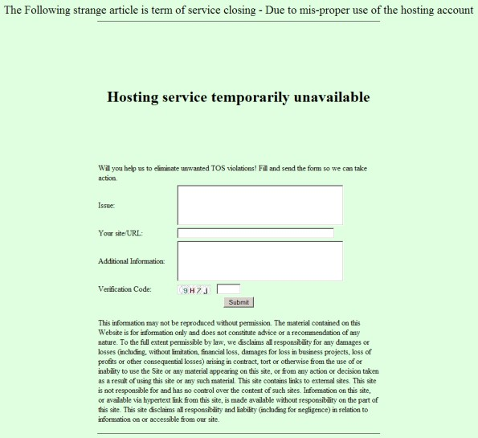

# Another Light Analysis of Referral Spammers

The "Account Terminated" swamp got a little muddier over the last few days. It appears that those of us who've started to blog about what we're finding are starting to get a lot of hits from others who are being targetted, and the scammers effectiveness is therefore being reduced as folk realize that the original message is just a ruse. The scammer, in an attempt to stay one step ahead has now added some new messages to his repartee, the list new includes:

1.  Account Terminated
2.  Hosting service temporarily unavailable
3.  -- Suspended until further notice --
4.  "" [an empty string]
5.  Account locked
6.  Service Unavailable! Genius. What's more, the opening line now has all kinds of alternative forms too:
7.  The Following strange article is term of service closing.
8.  The entire file is now in closing order
9.  The Following explanation is in suspension
10.  This former info is currently under investigation
11.  This entire rumor is currently in closing order

 

 Also, the scammer has now added an official looking feedback form to the page that even includes a captcha code, just to add an air of authenticity and professionalism. Make no mistake, I'm seeing hundreds of referrals every week from this URL - this is not an above board operation.

 Here's the killer blow, which illustrates why we're all seeing this spam - the google pagerank for psxtreme.com is currently 7/10 - the site has no content, no history of service, and yet it's pagerank is at a level that will push it almost to the top of any web search.

 If you're playing a percentage game with (for example) people who fancy a quick 10 minutes gambling on the net, then this is the thing that gets your site visited more than others. You have to annoy a lot of people to achieve it, but those who seek personal wealth don't often see the bigger picture.
