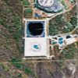

# Apple iPod: One Giant Leap for Advertising

I think this may be an exclusive! It's Apple's 30th birthday next month; and they're planning something big to mark the occasion.

Today I learned from a trusted source that Apple is poised to make history next Saturday when it unveils the worlds first advertisement that can be seen _from space_.

Apple had hoped to keep their creation secret until the grand unveiling, however, after I was tipped off, and with just a little bit of lateral digging, I was able to uncover enough background information to get a clue of the location.

From there, it was just a matter of firing up [Google Earth](http://earth.google.com), and hunting for it! The pictures are a few months old, but clearly show the advert well on the way to completion.

The sheer size of the publicity stunt is difficult to comprehend. It covers 893240 square metres; roughly equivalent to eighty football pitches.

The ad, which depicts Apple's flagship iPod product has been constructed on the site of an abandoned mineral mine in remote western Australia. It has been in development for almost two years since Apple's founder [Steve Jobs](http://en.wikipedia.org/wiki/Steve_Jobs) acquired the location during a game of poker with (the late) Australian publishing and gaming tycoon [Kerry Packer](http://en.wikipedia.org/wiki/Kerry_Packer).

Aliens need not worry about advertising regulations however; the general concensus is that the edge of space is at a height of 62 miles (100Km), and once you go much higher than that, the ad will very quickly shrink towards invisibility. It'll look like an iPod nano for a while, then maybe a tictac.

Speculation is currently rife that the grand unveiling will be coordinated with the launch of a touch screen Video iPod.

Apple have a press meeting scheduled at the start of next month when more details will be revealed - you heard it here first.

* See it in [Google Maps](http://maps.google.com/?t=k&ll=-30.516354,121.336956&spn=0.293105,0.234146).
* See it in [Google Earth](ipod.kmz).
