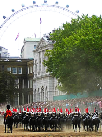

# Beach Volleyball; A British Twist

For me, the Sydney 2000 olympics beach volleyball was overshadowed by the constant references to Bondi Beach, as though somehow it was <em>the</em> most desirable place on earth.  Pardon my skepticism but Bondi's a tourist trap; a parody; it's long way from paradise.  I'm not being mean about the whole New South Wales coastline, but Bondi in particular is spoiled by it's popularity.

Spin-on to 2012, and if London wins the bid to host the Olympics the proposed location for the beach volleyball is [Horseguards Parade](http://www.london2012.org/en/bid/venues/venuelist/HorseGuardsParade.htm).

Its beach volleyball, again in a tourist trap, but this time there is no beach, and in it's place we add several hundred years of tradition by slipping in a quick [changing of the guard](http://www.royal.gov.uk/output/Page378.asp) during timeouts.

It has a certain undeniable finesse about it. London deserves to win for this alone, everything else is frills.
