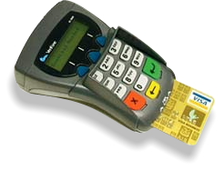

# Chips, PINs and Security Cameras

My local convenience store is typical of any corner store; there's perhaps 100 square meters of shop space, with security cameras at the end of each aisle and (as featured on every _smash-and-grab_ TV show) extra cameras focused on the checkout.

The cameras curtail shoplifting, and the new [Chip and PIN](http://en.wikipedia.org/wiki/Chip_and_pin) payment system reduces fraud. The shopkeepers are happy because their livelyhood is better protected, however, as I was buying milk this morning, I realised that these two security measures may have an _**unwanted** overlap_ that could leave the customer less protected.

Recent articles by [the Guardian](http://www.guardian.co.uk/crime/article/0,2763,1562681,00.html), [the BBC](http://news.bbc.co.uk/2/hi/science/nature/4213848.stm), [the Register](http://www.theregister.co.uk/2005/09/05/hi-tech_id_theft_cure_fallacy/) and [Bruce Schneier](http://www.schneier.com/blog/archives/2005/09/identity_cards.html) have highlighted some insight provided by [Dr. Emily Finch](http://www.uea.ac.uk/law/people/emily_finch.htm)'s interviews with credit card criminals:

> "One of the things that is very clear is that it is a difficult matter for a fraudster to get hold of somebody's card and then find out the PIN. So the focus has been changed to finding the PIN first, which is very, very easy if you are prepared to break social convention and look when people type the number in at the point of sale ... and then attempt to steal the card at a later date."

To combat such social miscreants, the _Chip and PIN_ machine that's installed in my local store (pictured) features a small finger shield that can partially obscure the view of a ne'er-do-well who has to be looking at just the right moment to be able to spot the PIN.

The effectiveness of this shield is largely compromised, however, because **the checkout camera stays squarely focused on the customer, and their PIN**, even when everybody else _does_ avert their gaze: so **anybody that has access to the shop's security recordings** doesn't need furtive glances, they **can take their time and study every delicate finger movement as the PIN is entered**.

If this is not happening already, it will, I guarantee it. Today the resolution on most ageing surveillance cameras is unlikely to be high enough to enable a frame-by-frame zoomed analysis of how a shoppers fingers move as they type their PIN, but that's changing, because of the rapidly decreasing cost of low and mid-range digital imaging equipment. The future of digital surveilance is crisp focused pictures, that can get a very good closeup of any keypad.

Next time you use your _chip and PIN_ card, take a look around and see if you're being recorded. Ask the shopkeeper about who has access to the security tapes. I asked at my local store (purely out of interest) and was met with an open mouthed "Uh?".

If you'd like to take the investigation further in the UK, then the Data Protection Act (DPA) provides for a useful means of gathering material that can illustrate the problem. The DPA grants [the subject](http://www.informationcommissioner.gov.uk/cms/DocumentUploads/subject%20access%20faq.pdf) of any CCTV recording access to "the information held about them, a description of why that information is being processed, and details of anyone who may see a copy of the data, to whom it may be transferred, and the logic involved in any automated decisions taken on the basis of that data."

So for the cost of a stamp, and a maximum fee of £10, it's possible to get a copy of the recording, and see for yourself whether your PIN is decipherable.
