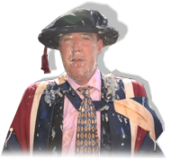

# Dr. Jeremy “Custard Pie” Clarkson

[Jeremy Clarkson](http://en.wikipedia.org/wiki/Jeremy_Clarkson), the journalist who is most famous for hosting the BBC motoring programme [Top Gear](http://en.wikipedia.org/wiki/Top_Gear) received an honourary Doctorate in Engineering from Oxford Brookes University today. Whilst posing for photographs afterwards he was attacked by an environmental protestor, brandishing a rather tasty looking gateaux.

It's common for people who are the victim of such attacks to show horror and indignation. Not so with Dr. Clarkson, who (in addition to surprise) appeared impressed by the audacity of the strike, and immediately commended the quality of the shot, affirming his praise with a cheery _thumbs up_ gesture.

So well done Jeremy for being a good sport, and furthermore well done to the protesters too; an excellent publicity move that will help keep environmental issues at the fore of people's minds.

Before I continue I should assuage any opinion you may be about to form that I don't like Clarkson or Top Gear. Top Gear is about the best program on telly on a Sunday night and Clarkson writes and presents good and interesting pieces; which he should do, because he's _very_ well paid for it.

### Dr. Celebrity

Whilst the environmental protestors have valid concerns with the reasons for the award, their action also illustrates a fundamental problem with honourary degrees: the _[new universities](http://en.wikipedia.org/wiki/New_Universities)_ (such as Oxford Brookes) are now fighting with each other in an annual tussle to assimilate famous alumni; but there are not enough worthy people to go around.

Clarkson for example, was proposed because of his "support for excellence in engineering", yet fundamentally he just presents a show where they drive cars and say whether they like them or not, which is quite often based on whether the car massages the egos of the all-male presenting team.

Compare this to the Honourary Degree that was awarded during my first graduation ceremony, which went to Helen Sharman OBE, the first British person in space, and you'll see what I'm hinting at. My bachelors degree was 10 years ago, and the universities are now running out of folk that have really achieved something remarkable, so they're turning to the fickle world of celebrity.

If the process continues then I have to wonder who our Universities will look to next. Perhaps we'll soon be applauding Dr [Jade Goody](http://en.wikipedia.org/wiki/Jade_Goody) for her services to education, or maybe Dr [Victoria Beckham](http://en.wikipedia.org/wiki/Victoria_Beckham) in recognition of her selfless failure to release another record. Forgive me, but I'd rather no honourary degrees at my next graduation.
