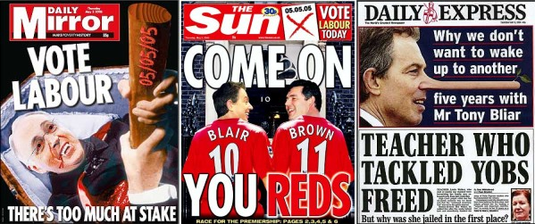

# Election Day Newspapers

For the 2005 election I looked over the manifesto of each party that I considered voting for.  I even looked at some of those that I would not touch with a barge-pole.  I pondered upon the issues that the parties were suggesting.  I tried to acknowledge the issues that they were ignoring until after the election.  I even went so far as to wonder (in a Socratic style) what I didn't know, and whether or not the absence might contain issues that should influence my vote.

Voting is so much more than just putting an X in a box.  In order to vote responsibly it is necessary to come to some conclusions about one's own beliefs.  So I'm delighted to see the press are encouraging a mature approach to voting this year.

Ever wonder why the popular press is _actually_ popular?  Perhaps it alleviates people from the need to think.  Read all about it, one opinion fits all, only 20p.  Fabulous prizes to be won.

What a triumph for liberty and democracy.
