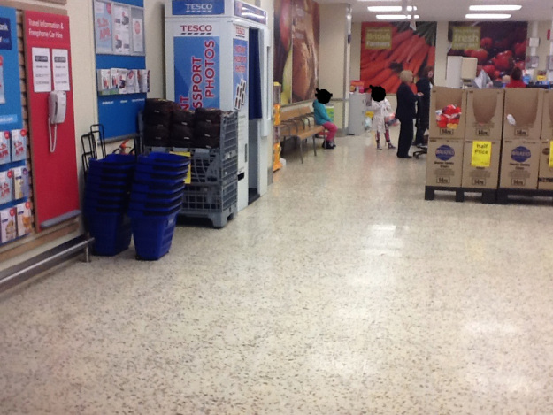

# Where is the best place to put a fire extinguisher?

Everything is everyone's collective responsibility. If you see something that seems a bit wonky, it makes sense to ask questions. Peace of mind should be the result, but what if you're not sure, or what if you ask questions and the answers are unconvincing?

So, dear lazyweb, I ask you, where is the best place to put a fire extinguisher?

In the following notes, bold emphasis is mine... This [article from Fire Protection UK](http://www.fireprotectiononline.co.uk/positioning-fire-extinguishers-for-quick-and-easy-use.html) suggests that:

> The positioning of your fire extinguishers is extremely important as every second counts in an emergency situation and you have to remember that **the person trying to find them may be a first time visitor to your premises**.

This makes good sense to me. Additionally [Essential Fire Safety](http://www.essentialfiresafety.co.uk/news/7/) add that:

> if you can **see the whole extinguisher from top to bottom**, you probably have good access to it.

[County Durham and Darlington Fire and Rescue Service](http://www.ddfra.co.uk/business-safety/number-of-fire-extinguishers) offer that extinguishers should be:

> in **conspicuous positions** where persons following an escape route can easily see them

The Fire Safety Advice Centre [observe](http://www.firesafe.org.uk/portable-fire-extinguisher-general/) that extinguishers:

> should be fixed where they can be **easily seen**, fixing them inside cupboards or behind doors will only **waste valuable time if a fire breaks out**.

Much of this advice _appears_ to be based on BS 5306-8:2012 (but that costs £68, so I'm not buying that on the basis of being a mildly concerned citizen).

So, given that this appears to be all common sense stuff, why do so many places hide their fire extinguishers? For example, here's my local supermarket.

* Can you **_see the whole of the extinguisher from top to bottom_**?
* Is it **_easily seen_ **and in a **_conspicuous position_ **so it will be noticed by a **_first time visitor to the premesis_**?

Hint: There's two, nestled behind the blue drag-baskets, next to the stacked charcoal.
