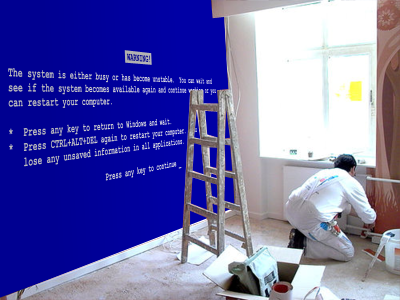

# Instant Home Redecoration with Electronic Paper

Fujitsu have been demonstrating what they hope is a mass-producable system that could make colour electronic paper a reality.

Electronic paper has been on the cards for a long
time, but one of the major obstacles was the requirement for a power supply, [Fujitsu's solution](http://www.fujitsu.com/global/news/pr/archives/month/2005/20050713-01.html) only requires power to change the image, so for static content, the power problem is circumvented. It's also highly durable, and can be flexed and poked without degrading.

The obvious route to market for this particular system is therefore the advertising billboard, where the early development cost of electronic paper can be offset by the cost-saving from not printing and distributing adverts to every bus shelter and hoarding.

There is potentially enough market here to warrant tooling and skilling a factory that can then improve and streamline the process enough that it's cost will
plummet and the rest of us can have dynamic wallpaper in our homes.

I wonder which room people would decorate first?
