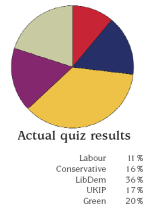

# Tactical Votes

With the UK General election all but upon us, politicians have turned their attention to tactical talk. Mr. Blair insists this is a two horse race, and suggests that voting for the Liberal Democrats will let the Conservatives in. Mr. Howard suggests the voting for the Liberal Democrats will give Labour another chance.

Curiously then, the [results of an online poll of 250,000 people](http://www.whoshouldyouvotefor.com/250Kdata.pdf) at [WhoShouldYouVoteFor.com](http://www.WhoShouldYouVoteFor.com), suggest that where policy is concerned, tomorrows election is anything but the two horse race that Blair and Howard are painting it to be. What the chart suggests is that if people were to vote for the party whose policies best matched their own beliefs, the Liberal Democrats would walk it.

What's not shown on the poll is any demographic detail of those polled. Given that the site has only recently been created the people who have discovered it are are most likely to be young, internet savvy and politically aware. The upshot of this is that the Labour and Conservative parties are probably safe to target their marketing and scare tactics at floating voters in the middle ground, for now.

By the time the 2009/10 election comes around, it's highly likely that sites such as this will be far more sophisticated, and have a significantly better reach, hopefully relieving more of the public from the apparent necessity of tactical voting, perhaps resulting in a more representative parliament Political utopia here we come?
