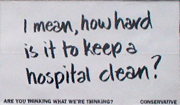
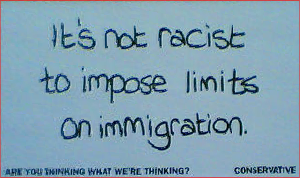

# UK Election 2005: Adverts and Immigration

The UK General election is now only three weeks away, so the country is awash with billboard adverts and whole pages of newspapers bought for the purpose of swaying the public's opinion.  Unlike commercial adverts there seem to be fewer restrictions on what political parties are allowed to do.  So rather than promoting their own visions, the Labour and Conservative parties are spending money attacking each other.

The Conservative party in particular is scoring repeated own goals in this respect.  One of their billboards attempts to attack the current Labour government's handling of the National Health Service; but it merely succeeds in:

1.  highlighting their naivety on bacteriological matters and
2.  insulting the majority of hospital staff.

The second own goal by the tories is their stance on immigration.  The "it's not racist to impose limits on immigration" poster, and Michael Howard's accompanying filibustering cause me particular annoyance.

The immigration that most people are aware of is either the newsworthy _illegal immigration_, like [when lorry loads of people die](http://www.amnesty.org.uk/news/press/12644.shtml) because they are so desparate to lead a life outside of squalour that they take any and every chance they have - or the similarly newsworthy stories of [detained foreign nationals](http://news.bbc.co.uk/1/hi/uk/4101751.stm) or social services scroungers.

The overwhelming majority of immigrants get jobs, work hard and integrate with society - slowly at first perhaps, but within two generations the integration is complete.  This doesn't get reported on because it's a slow burning, large scale success.  It's the rare cases that get picked upon by politicians seeking to further their own aims, and the tabloid press seeking to sell more papers by sensationalizing irregularities.

On it's own, the poster **is** correct.  Imposing a limits in itself is not racist, because people of all races outside the country are similarly affected. Britain is already a mongrel nation in a mongral world, so the Conservative argument comes down to one of "we were here first so although we think it's right to help immigrants enter the country, we will only help a set number of people from our collective tax pot in each year."

On it's own, this argument is likely to be defensible to the extent that newspapers and television programs will cover it; but this is not an isolated issue and it is only in isolation that the argument remains valid.  The Conservatives have justified their decision to focus attention on immigration by describing [alarming statistics](http://www.conservatives.com/tile.do?def=news.story.page&obj_id=121611) about population increase: if this is the case, then in isolation, the statement on the poster is alarmist and misleading for one very obvious reason: **to impose limits on immigration, without imposing equally strict birth control for the existing population is hypocritical**. The right of entry into any country should be the same for all people irrespective of vessel: land, sea, air or birth canal.
