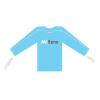

# Wii Mittens

The Nintendo Wii has now enjoyed it's first week of sales and stories are floating around the net that the wireless controller (mentioned <a href="http://boakes.org/game-controller-wars/">previously</a>) has been finding itself airborne due to players getting sweaty hands.

Videos of the problem are already surfacing. I can't help but think that the old solution for "not losing your mittens" would help here - you know, the bit of string that connects your mittens via the arms of your anorak...

Exchange the mittens for the Wii nunchuk controller, and exchange the anorak for a nice wicking top that helps keep 1UP cool.

