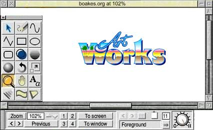
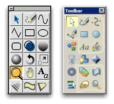

# Xara, Linux and Open Source

I count myself lucky that I discovered [Xara](http://xara.com)'s drawing tools many years ago.

When _Xara Studio_ was released it caused real consternation among the businesses that were producing computer art packages because it was _years_ ahead of the competition in both features and (most importantly) speed.

The main competition (Corel) was so worried, that it licensed the product and released it alongside it's flagship "[Corel DRAW!](http://en.wikipedia.org/wiki/CorelDRAW)" product. It beats me how they're going to keep paying the bills though...

I had used Xara Studio's predecessor ([Artworks](http://en.wikipedia.org/wiki/Artworks)) on a friend's computer so I knew Xara Studio would be good, and its reviews confirmed it. Artworks was released 15 years ago (1991); _way_ ahead of it's time. I also owned a copy of Impression Publisher, a [DTP](http://en.wikipedia.org/wiki/Desktop_publishing) product of the same company and used it throughout my undergrad years for submitting assignments.

Over the years Xara has done me proud, and they've taken some cash from my pockets for their efforts. I bought CorelXARA, and I upgraded as new releases became available: Xara X, then Xara X1.

Each upgrade costs costs money, and although each upgrade offers new capabilities or performance improvements, not all of the new capabilities are useful to all users. What is most surprising is that despite 15 years of development, the basic toolset of X1 is remarkably similar that of Artworks in 1991\. By no means is this a story of "money for old rope"; it's more an example of brilliant user interface design from the outset.

## Open Source Xara

Last year Xara released the [source code to Xara Xtreme](http://www.xaraxtreme.org/) under the GNU Public License, which means anyone can download the source, build the software, and use it, or change it - all free of charge.

I've experienced this from the inside, having once worked for a company that [open-sourced it's flagship product](http://mozilla.org/), cutting its revenue by 50% overnight. Xara are in a slightly different position because they are still selling the Windows product, but giving it away on Linux. There must be a sustainable business model behind Xara's open-source decision, but it's not immediately obvious.

## An Upgrade Quandary

So, I now find myself in the curious position of wondering whether to upgrade to the latest release, Xara Xtreme, or perhaps I should jump ship entirely and become a 100% Linux user. Xara is (or was) the last thing that's keeping me on Windows. I now find myself wanting and needing to edit SVG images, but the windows version can't do it, and crucially the linux version appears to have this capability.

## To pay, or not to pay

So there's now an imbalance:

1.  I can pay for Xara Xtreme on Windows, or
2.  I can switch to Linux and get it free, or
3.  I can download the source code and build it _for Windows (!)_, or
4.  I can wait for someone else to build the GPL version for Windows and then download that. There's nothing in the GPL to prohibit the re-engineering or release of a free windows version, and Xara must know this. I suppose Xara might be making more money from their bells+whistles one-click-website software, so the decision to open-source Xara Xtreme may have been a strategic self-destruct move to exit a market that was becoming infiltrated by open-source competitors such as [Inkscape](http://www.inkscape.org/). It was probably a sensible decision to quit whilst ahead, and maybe make a few final windows upgrade sales as the market dies. This is exactly the kind of thing I was talking about when I [mentioned](/hello) that I harbour concerns about the open source business model, there are times when it hurts companies (Xara has lost a revenue stream on a fantastic product) and there are times when it hurts consumers (because Linux users get the product freely, whilst Windows users pay $80 for it).

## Goodbye Windows?

So, aside from:

1.  code stability whilst the open-source version matures, and
2.  a little performance loss (because generic code can never be as fast as platform specific code), and
3.  a general good natured financial appreciation for Xara
4.  and the aquaduct... ...I can't find an obvious reason to pay for the Xara upgrade any more, and with Windows Vista around the corner, I think I've found my exit point from the world of Microsoft OS's.
